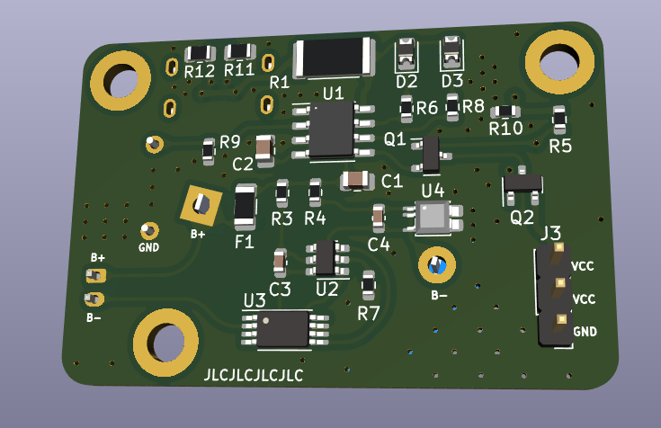
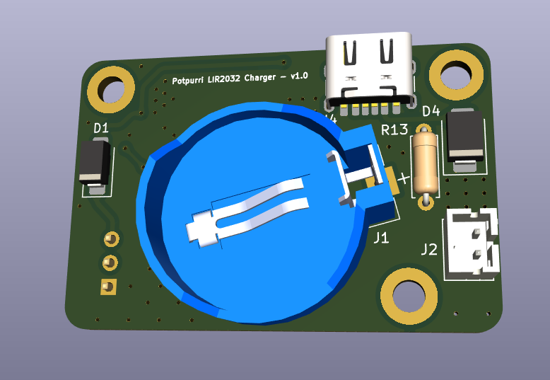
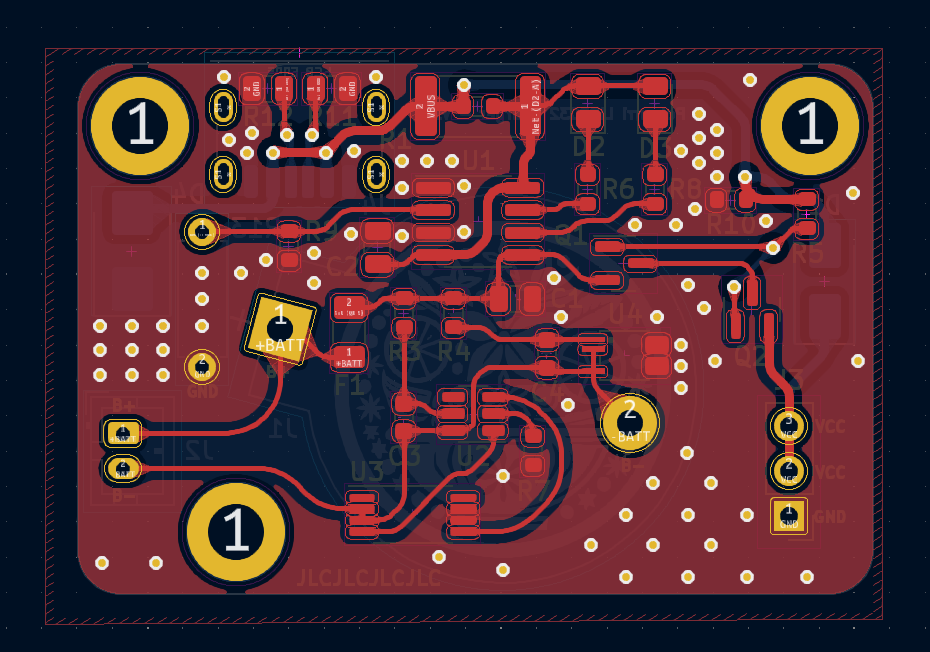
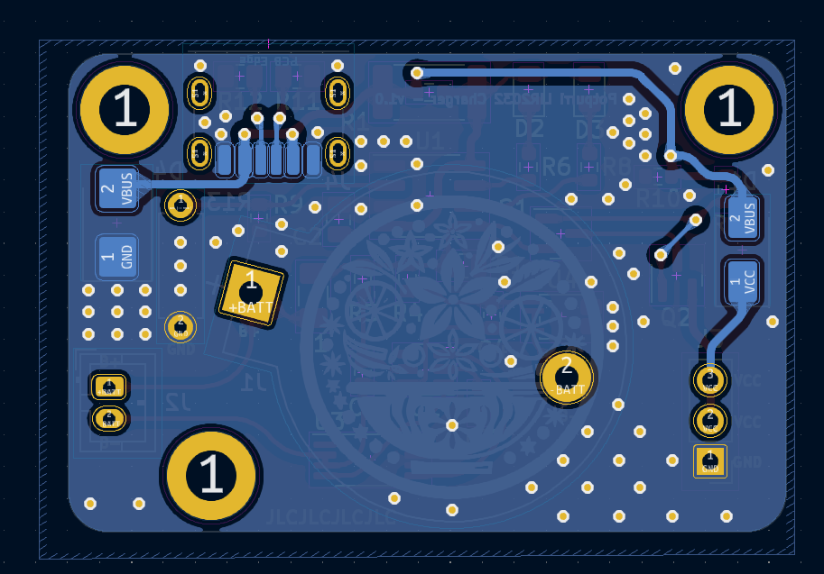

# LIR2032 Battery Charging Board

## Overview

Charging board for LIR2032 batteries (or other lithium type button/coin cell batteries with the same diameter and max voltage of 4.2V).

This project features a charging board for LIR2032 batteries. It uses a TP4056 to monitor charging and provides options for safety components. The circuit includes components to manage the charging process efficiently and safely.

**Note:** This project is a work in progress. The purpose is to have fun and learn more about these technologies.

## Features

The board includes the following components:

- **TP4056**: For monitoring the charging process.
- **Safety options**: Can use either a DW01A and a FS8205A or a XB7608AJ for safety.
- **P-MOSFETs**: Two P-MOSFETs cut the connection between the battery and the load during charging (if a load is connected to the charging board).
- **Schottky Diode**: Available to forward current from the USB-C charging input to the load during charging.
- **Charging Current Settings (Resistor R9)**: The resistor R9 is used to set the charging current with the following correlations:

| Resistor (Ω) | Charging Current (mA) |
|--------------|------------------------|
| 10k          | 120                    |
| 12k          | 100                    |
| 15k          | 80.0                   |
| 18k          | 66.7                   |
| 22k          | 54.5                   |
| 27k          | 44.4                   |
| 33k          | 36.4                   |
| 39k          | 30.8                   |
| 47k          | 25.5                   |
| 56k          | 21.4                   |
| 68k          | 17.6                   |
| 82k          | 14.6                   |
| 100k         | 12.0                   |

## Images

Below are images of the PCB:

3D render of the front view of the PCB

3D render of the back view of the PCB

Front view of the actual PCB

Back view of the PCB

## Schematics

For detailed schematics, please refer to the [schematic PDF](LIR2032-charger/imgs/schematic.pdf).

